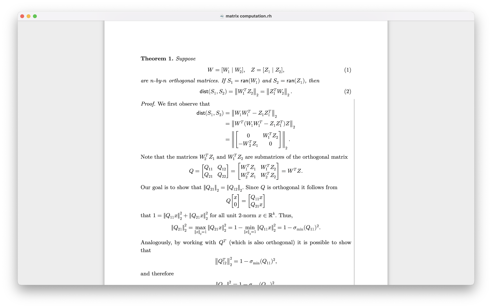

# Rohan

Rohan is an experimental structured editor with interactive math editing capabilities. Package `swift-rohan` provides the core functionality for Rohan.

The goal of Rohan is to provide a user-friendly interface for editing mathematical expressions, allowing users to focus on the content rather than the formatting.

We are still experimenting with the design and functionality of Rohan, and an intuitive user interface is still a work in progress. The current version is a proof of concept and requires further development to become a fully functional editor.

# Features

We have the following features:

- Numbered and unnumbered sections
- Styled text (`\emph`, `\textbf`, `\textit`, `\textt`)
- `{itemize}` and `{enumerate}` environments for lists
- `{theorem}`, `{lemma}`, `{corollary}`, `{proof}` environments for mathematical statements
- Inline math expression and display math expression
- Numbered and unnumbered equations (`{equation}`, `{equation*}`, `{align}`, `{align*}`, etc.)
- Auto-replacement of text sequence with math expressions

We lack the following features:

- Labels and References
- Bibliography and Citations
- Images and Captions
- Tables

# Installation

Rohan is available on [Apple App Store](https://apps.apple.com/us/app/rohan/id6748970954) and can be installed on macOS devices.

To build Rohan from source, open in Xcode the project in directory `Rohan` and run the `Rohan` scheme.

# Directory Structure

The directory structure of the Rohan project is as follows:

| Directory       | Description                                       |
| --------------- | ------------------------------------------------- |
| `Rohan`         | Contains the main application code and resources. |
| `Sources`       | Contains the core functionality of Rohan.         |
| `Tests`         | Contains unit tests for the Rohan functionality.  |
| `Documentation` | Contains documentation and screenshots.           |

# Contributing

We welcome contributions to Rohan! If you have ideas for new features, improvements, or bug fixes, please open an issue or submit a pull request.

# License

Rohan is licensed under Apache License 2.0. See the [LICENSE](LICENSE) file for more details.

# Acknowledgements

We are influenced by the design of [Typst](https://github.com/typst/typst) and the implementation of [STTextView](https://github.com/krzyzanowskim/STTextView).
